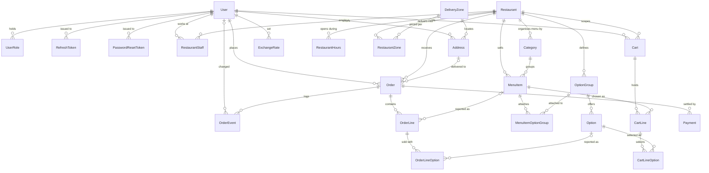
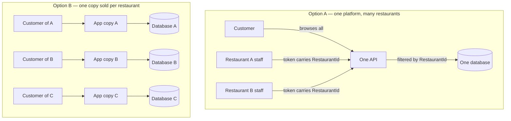

# Domain Model

**Status:** Implemented — `OrderingSystem.Domain` builds clean and is guarded by three tests
**Companion to:** `ARCHITECTURE.md`
**Scale:** 25 entities, 185 scalar columns, 7 enums

Everything below is generated from the entity source, so it cannot drift from the code.
Navigation properties are omitted from the column tables — they are relationships, and the
map above shows them.

---

## 1. The whole schema, connected

`PlatformSetting` is the one table with no relationship at all — it is a key/value store for the
default commission and the stale-order threshold, read by the application and edited by an admin.

### How to read it

Four things explain most of the shape:

**`Restaurant` is the tenant.** Trace outward from it and you find nearly every menu, cart and
order row. That fan-out is exactly the surface the query filters in ADR-07 protect: every one of
those tables carries `RestaurantId`, and a staff token that names a different restaurant must get
403 on all of them.

**The catalogue and the order touch only through dotted, optional links.** `MenuItem |o--o{
OrderLine` and `Option |o--o{ OrderLineOption` are nullable on purpose. An order line carries its
own copy of the name and price; the link back to the live item exists so reporting can ask "how
many of this dish did we sell", and for nothing else. Delete the item and the order still reads
correctly.

**Cart and Order look alike but behave oppositely.** `CartLine` points at a live `MenuItem` and
stores no price, so the basket always reflects today's menu. `OrderLine` stores name and price and
only optionally points anywhere, so it always reflects the day it was sold.

**`User` reaches into three unrelated corners.** It is the customer on an order, the actor on an
order event, and the admin who set an exchange rate. One account table, three different jobs —
which is why roles are a separate additive table rather than a column.

---

## 2. Every column

### Identity and auth

#### `PasswordResetToken`

| Column | Type | Null | Notes |
|---|---|---|---|
| `Id` | Guid | — |  |
| `UserId` | Guid | — |  |
| `TokenHash` | string | — |  |
| `CreatedAt` | DateTimeOffset | — |  |
| `ExpiresAt` | DateTimeOffset | — |  |
| `UsedAt` | DateTimeOffset | yes |  |

#### `RefreshToken`

| Column | Type | Null | Notes |
|---|---|---|---|
| `Id` | Guid | — |  |
| `UserId` | Guid | — |  |
| `FamilyId` | Guid | — | Every token descended from one login shares this. Revoking on reuse works on the family, not the single row, so a stolen token cannot be traded for a fresh one |
| `TokenHash` | string | — | SHA-256 of the token, never the token itself. A leaked database must not hand out working sessions |
| `CreatedAt` | DateTimeOffset | — |  |
| `ExpiresAt` | DateTimeOffset | — |  |
| `UsedAt` | DateTimeOffset | yes | Set when exchanged. Non-null here plus a fresh presentation is the theft signal |
| `RevokedAt` | DateTimeOffset | yes | Set on logout, on password change, or when the family is revoked |

#### `User`

| Column | Type | Null | Notes |
|---|---|---|---|
| `Id` | Guid | — |  |
| `Email` | string | — | Unique, and the login identifier. Stored lowercased so lookups are unambiguous |
| `PasswordHash` | string | — | PBKDF2 via IPasswordHasher. Never a plaintext or reversible value |
| `FullName` | string | — |  |
| `Phone` | string | — |  |
| `IsActive` | bool | — | Deactivation instead of deletion — orders must keep resolving their customer |
| `CreatedAt` | DateTimeOffset | — |  |

#### `UserRole`

| Column | Type | Null | Notes |
|---|---|---|---|
| `UserId` | Guid | — |  |
| `Role` | RoleType | — |  |

### Restaurants (the tenant)

#### `Restaurant`

| Column | Type | Null | Notes |
|---|---|---|---|
| `Id` | Guid | — |  |
| `Name` | string | — |  |
| `Slug` | string | — | Unique, URL-safe. What appears in a storefront link rather than the id |
| `Description` | string | yes |  |
| `LogoUrl` | string | yes |  |
| `CoverUrl` | string | yes |  |
| `Phone` | string | — |  |
| `IsActive` | bool | — | Set by a platform admin. False hides the restaurant entirely |
| `IsAcceptingOrders` | bool | — | The restaurant's own switch, for a rush or an unplanned closure. Separate from `IsActive` so a busy kitchen never needs a platform admin, and separate from opening hours so it can override them in either direction |
| `CommissionPercent` | decimal | — | Current rate, applied to new orders only. Each order snapshots its own copy, so changing this never rewrites historical settlement |
| `MinOrderUsd` | decimal | — | Checked against the subtotal, excluding delivery fee |
| `DefaultPrepMinutes` | int | — | Kitchen time. Delivery time comes from the zone and is added on top |
| `CreatedAt` | DateTimeOffset | — |  |

#### `RestaurantHours`

| Column | Type | Null | Notes |
|---|---|---|---|
| `Id` | Guid | — |  |
| `RestaurantId` | Guid | — |  |
| `DayOfWeek` | DayOfWeek | — |  |
| `OpenTime` | TimeOnly | — | Local restaurant wall-clock time, not UTC. A kitchen opens at 11am regardless of offset |
| `CloseTime` | TimeOnly | — | May be earlier than `OpenTime`, meaning the window runs past midnight — 18:00 to 02:00 is one row, not two |

#### `RestaurantStaff`

| Column | Type | Null | Notes |
|---|---|---|---|
| `UserId` | Guid | — |  |
| `RestaurantId` | Guid | — |  |
| `StaffRole` | StaffRoleType | — |  |
| `CreatedAt` | DateTimeOffset | — |  |

### Geography and addresses

#### `Address`

| Column | Type | Null | Notes |
|---|---|---|---|
| `Id` | Guid | — |  |
| `UserId` | Guid | — |  |
| `ZoneId` | Guid | — |  |
| `Label` | string | — | The customer's own name for it — "Home", "Office" |
| `Line1` | string | — |  |
| `Building` | string | yes |  |
| `Floor` | string | yes |  |
| `Landmark` | string | yes | "Above the pharmacy, opposite the church." In practice the most useful field here |
| `Lat` | decimal | yes |  |
| `Lng` | decimal | yes |  |
| `IsDefault` | bool | — | At most one per user; enforced by a filtered unique index |
| `CreatedAt` | DateTimeOffset | — |  |
| `IsDeleted` | bool | — | Soft delete. Orders reference the address they were delivered to, so removing the row would erase where a past order went |

#### `DeliveryZone`

| Column | Type | Null | Notes |
|---|---|---|---|
| `Id` | Guid | — |  |
| `Name` | string | — |  |
| `IsActive` | bool | — |  |

#### `RestaurantZone`

| Column | Type | Null | Notes |
|---|---|---|---|
| `RestaurantId` | Guid | — |  |
| `ZoneId` | Guid | — |  |
| `DeliveryFeeUsd` | decimal | — |  |
| `EstimatedMinutes` | int | — | Travel time only. The customer's estimate is this plus the restaurant's prep time |
| `IsActive` | bool | — | Lets a restaurant suspend a zone without losing its configured fee |

### Menu and options

#### `Category`

| Column | Type | Null | Notes |
|---|---|---|---|
| `Id` | Guid | — |  |
| `RestaurantId` | Guid | — |  |
| `Name` | string | — |  |
| `SortOrder` | int | — | Display position. The menu is never sorted alphabetically — sequence is a choice the restaurant makes |
| `IsActive` | bool | — |  |

#### `MenuItem`

| Column | Type | Null | Notes |
|---|---|---|---|
| `Id` | Guid | — |  |
| `RestaurantId` | Guid | — |  |
| `CategoryId` | Guid | — |  |
| `Name` | string | — |  |
| `Description` | string | yes |  |
| `BasePriceUsd` | decimal | — | USD, decimal(10,2). Never float — see the money rules in ARCHITECTURE.md |
| `ImageUrl` | string | yes |  |
| `IsAvailable` | bool | — | Sold out for now. The item stays visible and greyed out rather than vanishing, because a disappearing item reads as a broken menu to a returning customer |
| `SortOrder` | int | — |  |
| `IsDeleted` | bool | — | Soft delete. A hard delete would orphan every historical order line that sold this item. Deleted items are excluded by a global query filter, not by each caller remembering |
| `CreatedAt` | DateTimeOffset | — |  |

#### `MenuItemOptionGroup`

| Column | Type | Null | Notes |
|---|---|---|---|
| `MenuItemId` | Guid | — |  |
| `OptionGroupId` | Guid | — |  |
| `SortOrder` | int | — | Position of this group on this item's detail screen |
| `MinSelectOverride` | int | yes | Null inherits `MinSelect` |
| `MaxSelectOverride` | int | yes | Null inherits `MaxSelect`. Note that an inherited null and an overriding null are the same value, so removing a cap for one item means clearing the override, not setting it to null |

#### `Option`

| Column | Type | Null | Notes |
|---|---|---|---|
| `Id` | Guid | — |  |
| `OptionGroupId` | Guid | — |  |
| `Name` | string | — |  |
| `PriceDeltaUsd` | decimal | — | Added to the item's base price. Zero is normal ("no pickles"), and negative is allowed so a removal can genuinely discount the line |
| `MaxQuantity` | int | — | How many times this one option may be taken on a single line — 2 permits double cheese. One means on or off |
| `IsAvailable` | bool | — |  |
| `SortOrder` | int | — |  |
| `IsDeleted` | bool | — | Soft delete. Order lines keep a nullable reference back to this row |

#### `OptionGroup`

| Column | Type | Null | Notes |
|---|---|---|---|
| `Id` | Guid | — |  |
| `RestaurantId` | Guid | — |  |
| `Name` | string | — |  |
| `MinSelect` | int | — | Zero means the group is optional. One or more makes it a required choice |
| `MaxSelect` | int | yes | Null means unlimited. One makes the group behave as a radio |
| `SortOrder` | int | — |  |
| `IsDeleted` | bool | — | Soft delete, for the same reason menu items have one: order lines reference these |

### Cart

#### `Cart`

| Column | Type | Null | Notes |
|---|---|---|---|
| `Id` | Guid | — |  |
| `UserId` | Guid | — |  |
| `RestaurantId` | Guid | — |  |
| `CreatedAt` | DateTimeOffset | — |  |
| `UpdatedAt` | DateTimeOffset | — |  |

#### `CartLine`

| Column | Type | Null | Notes |
|---|---|---|---|
| `Id` | Guid | — |  |
| `CartId` | Guid | — |  |
| `MenuItemId` | Guid | — |  |
| `Quantity` | int | — |  |
| `Note` | string | yes | Free text from the customer — "no pickles", "well done" |

#### `CartLineOption`

| Column | Type | Null | Notes |
|---|---|---|---|
| `CartLineId` | Guid | — |  |
| `OptionId` | Guid | — |  |
| `Quantity` | int | — | Bounded by `MaxQuantity`, validated server-side at checkout |

### Orders, payment and history

#### `Order`

| Column | Type | Null | Notes |
|---|---|---|---|
| `Id` | Guid | — |  |
| `OrderNumber` | string | — | Human-readable reference shown to customer and kitchen. Unique across the platform |
| `CustomerId` | Guid | — |  |
| `RestaurantId` | Guid | — |  |
| `AddressId` | Guid | yes | Null for pickup. Kept for reporting only — everything needed to deliver the order is in the snapshot fields below, because the customer may edit or delete this address later |
| `FulfillmentType` | FulfillmentType | — |  |
| `Status` | OrderStatus | — |  |
| `DeliveryZoneName` | string | yes |  |
| `DeliveryLine1` | string | yes |  |
| `DeliveryBuilding` | string | yes |  |
| `DeliveryFloor` | string | yes |  |
| `DeliveryLandmark` | string | yes |  |
| `DeliveryLat` | decimal | yes |  |
| `DeliveryLng` | decimal | yes |  |
| `PaymentMethod` | PaymentMethod | — |  |
| `PaymentStatus` | PaymentStatus | — |  |
| `SubtotalUsd` | decimal | — | Sum of the order lines. Minimum-order checks run against this, not the total |
| `DeliveryFeeUsd` | decimal | — |  |
| `TaxUsd` | decimal | — | Always zero — no tax was in scope. The column stays so that charging VAT later is a configuration change, not a migration plus a rewrite of every historical total |
| `DiscountUsd` | decimal | — |  |
| `TotalUsd` | decimal | — | Subtotal + delivery fee + tax − discount. Stored, not computed on read |
| `ExchangeRateLbp` | decimal | — | Rate in force when the order was placed. The customer's receipt shows the same LBP figure forever, however far the rate moves afterwards |
| `CommissionPercent` | decimal | — | The restaurant's rate at the time, copied here. Changing a restaurant's commission must never silently restate past settlement |
| `CommissionUsd` | decimal | — | Money value of the commission, so settlement never re-derives it from a percentage |
| `PromisedMinutesMin` | int | — | Prep time plus the zone's travel estimate, frozen so the promise can be judged after the fact |
| `PromisedMinutesMax` | int | — |  |
| `CustomerNote` | string | yes |  |
| `RejectionReason` | RejectionReason | yes | Required when `Status` is Rejected, null otherwise |
| `RejectionNote` | string | yes | Optional detail alongside the reason. Never a substitute for it |
| `IdempotencyKey` | Guid | — | Supplied by the client, one per checkout attempt. A unique index on it means a double-tap on a poor connection returns the original order rather than creating a second one |
| `RowVersion` | byte[] | — | SQL Server rowversion. Two staff pressing Accept on two tablets: the second write fails and the screen refreshes, instead of both appearing to succeed |
| `PlacedAt` | DateTimeOffset | — |  |

#### `OrderEvent`

| Column | Type | Null | Notes |
|---|---|---|---|
| `Id` | Guid | — |  |
| `OrderId` | Guid | — |  |
| `FromStatus` | OrderStatus | yes | Null on the first event, where the order came into being at Placed |
| `ToStatus` | OrderStatus | — |  |
| `ChangedByUserId` | Guid | yes | Null when the platform itself made the change rather than a person |
| `Note` | string | yes |  |
| `CreatedAt` | DateTimeOffset | — |  |

#### `OrderLine`

| Column | Type | Null | Notes |
|---|---|---|---|
| `Id` | Guid | — |  |
| `OrderId` | Guid | — |  |
| `MenuItemId` | Guid | yes | Nullable and for reporting only ("how many times did we sell this dish?"). Never read to display the line — the item may since have been deleted |
| `ItemNameSnapshot` | string | — | The item's name at the moment of ordering |
| `UnitPriceUsd` | decimal | — | Base price plus every selected option's delta, per unit |
| `Quantity` | int | — |  |
| `LineTotalUsd` | decimal | — | UnitPrice × Quantity, stored rather than computed so historical arithmetic cannot drift |
| `Note` | string | yes |  |

#### `OrderLineOption`

| Column | Type | Null | Notes |
|---|---|---|---|
| `Id` | Guid | — |  |
| `OrderLineId` | Guid | — |  |
| `OptionId` | Guid | yes | Nullable, for reporting only. Same reasoning as OrderLine.MenuItemId |
| `GroupNameSnapshot` | string | — |  |
| `OptionNameSnapshot` | string | — |  |
| `PriceDeltaUsd` | decimal | — | Per unit of this option, as it was priced then. May be zero or negative |
| `Quantity` | int | — |  |

#### `Payment`

| Column | Type | Null | Notes |
|---|---|---|---|
| `Id` | Guid | — |  |
| `OrderId` | Guid | — |  |
| `Method` | PaymentMethod | — |  |
| `AmountUsd` | decimal | — |  |
| `Status` | PaymentStatus | — |  |
| `ProviderRef` | string | yes | The gateway's own reference. Null for cash, which has no provider |
| `CreatedAt` | DateTimeOffset | — |  |

### Platform configuration

#### `ExchangeRate`

| Column | Type | Null | Notes |
|---|---|---|---|
| `Id` | Guid | — |  |
| `RateLbpPerUsd` | decimal | — | Lebanese pounds per one US dollar |
| `EffectiveFrom` | DateTimeOffset | — |  |
| `SetByUserId` | Guid | — |  |
| `CreatedAt` | DateTimeOffset | — |  |

#### `PlatformSetting`

| Column | Type | Null | Notes |
|---|---|---|---|
| `Key` | string | — | Primary key. See `PlatformSettingKeys` for the known names |
| `Value` | string | — |  |
| `UpdatedAt` | DateTimeOffset | — |  |
| `UpdatedByUserId` | Guid | yes |  |

---

## 3. The rules this schema encodes

**Snapshots.** `OrderLine`, `OrderLineOption` and the `Delivery*` fields on `Order` are copies,
not lookups. A price rise, a renamed dish, an edited address or a changed commission rate cannot
reach backwards into an order that is already placed. `Order.CommissionPercent` is snapshotted for
the same reason: settlement figures for last month must not move when this month's rate changes.

**Tenancy.** Every menu, cart and order table carries `RestaurantId`. Nothing relies on the UI
hiding a button.

**Soft delete.** `MenuItem`, `OptionGroup`, `Option` and `Address` are never physically removed,
because order rows point at them. `User` has `IsActive` rather than deletion for the same reason.

**Money.** Every monetary column is `decimal`, USD, and will be configured as `decimal(10,2)` in
Step 4. LBP is never stored — it is computed from `Order.ExchangeRateLbp`, which is frozen at
placement so a receipt shows the same figure forever.

**Time.** Every timestamp is `DateTimeOffset`, not `DateTime`. `DateTime` carries a `Kind` flag
that is easy to lose across a serialisation boundary, and the result is a local time silently
stored as if it were UTC. `DateTimeOffset` makes that mistake unrepresentable. The exception is
`RestaurantHours`, which uses `TimeOnly` because a kitchen opens at 11am regardless of offset.

**Concurrency.** `Order.RowVersion` is the only concurrency token in the schema, because the order
is the only row two people race to change.

**Enum stability.** Every enum member has an explicit number, and a test fails the build if any
enum has a member valued 0. Enums are stored as integers; if someone inserts a value in the middle
and the numbering shifts, every existing row silently changes meaning.

---

## 4. Two limitations worth knowing about

**An item cannot widen a group's cap to unlimited.** `MaxSelectOverride` uses null to mean
"inherit", and `OptionGroup.MaxSelect` uses null to mean "unlimited" — so there is no value that
says "this item has no cap even though the group does". The workaround is to leave the group
uncapped and set a limit per item. Fixing it properly would need a sentinel value or a second
flag, and neither is worth the confusion for a case that has not come up.

**`EffectiveMinSelect` and `EffectiveMaxSelect` need the group loaded.** They read through the
`OptionGroup` navigation, so a caller that fetched a `MenuItemOptionGroup` without an `Include`
gets a null reference. Option validation always loads the group, so this is safe where it matters
— but it is a sharp edge, and Step 4 will note it in the configuration.

---

## 5. Why one multi-tenant platform, not a copy sold per restaurant

This is the fork worth being deliberate about, because the two paths are different businesses,
not just different code.

You are right that Option B gets isolation for free — restaurant A physically cannot reach
restaurant B's database, so no query filter can be forgotten. That is a genuine advantage and the
strongest argument for it.

Three things outweigh it.

**1. Multi-tenant is a superset. Single-tenant is a dead end.**
A multi-tenant system can be sold as a single-restaurant product by onboarding exactly one tenant —
same code, one row in `Restaurant`. Going the other way is a rewrite: adding `RestaurantId` to every
table, backfilling it, and reworking every query. Option A keeps both business models available;
Option B closes one permanently.

**2. Option B deletes about a third of the spec.**
Commission and two-directional settlement (spec §8) only exist when a platform sits between customer
and restaurant. So does the `PlatformAdmin` role, the shared `DeliveryZone` table, and cross-restaurant
browsing. If a customer of restaurant A is a different account from a customer of restaurant B, the
whole marketplace premise goes with it — including the part of the spec that is most worth showing.

**3. Operational cost scales linearly and eats the margin.**
Ten clients on Option B means ten databases to migrate on every release, ten deployments to keep in
step, and ten versions that drift the moment one client delays an upgrade. On Option A a release is
one migration and one deploy regardless of how many restaurants are on it.

**What Option A costs, stated honestly.** Isolation becomes a code property rather than a physical
one, and a bug in it is a cross-tenant data leak — the worst failure this system can have. That is
exactly why ADR-07 spends three layers on it (query filters, explicit write guards, and tests that
assert 403) instead of trusting any one of them.

**The escape hatch stays open.** If a client ever demands their own database — for a contract, or
because they are large enough to want it — you run a second instance of the same code with one
tenant in it. Nothing needs rewriting. That option only exists on Option A.
