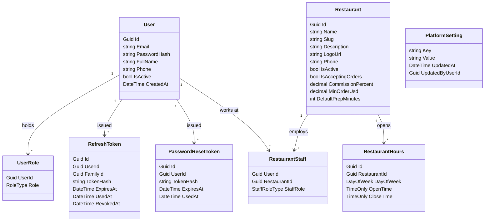
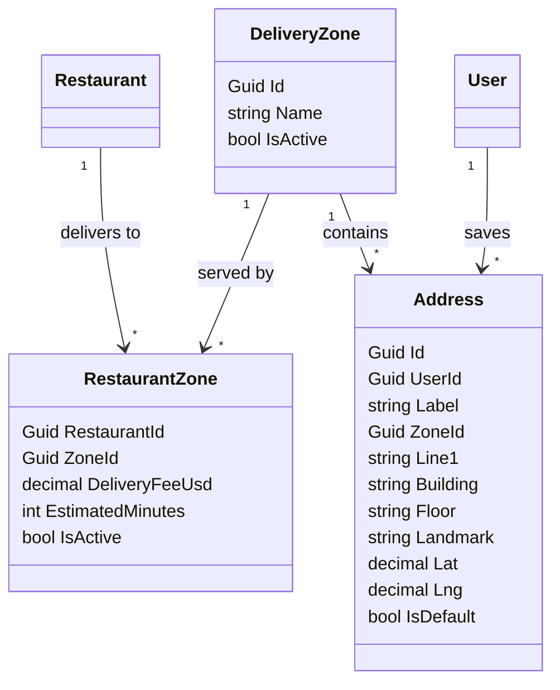
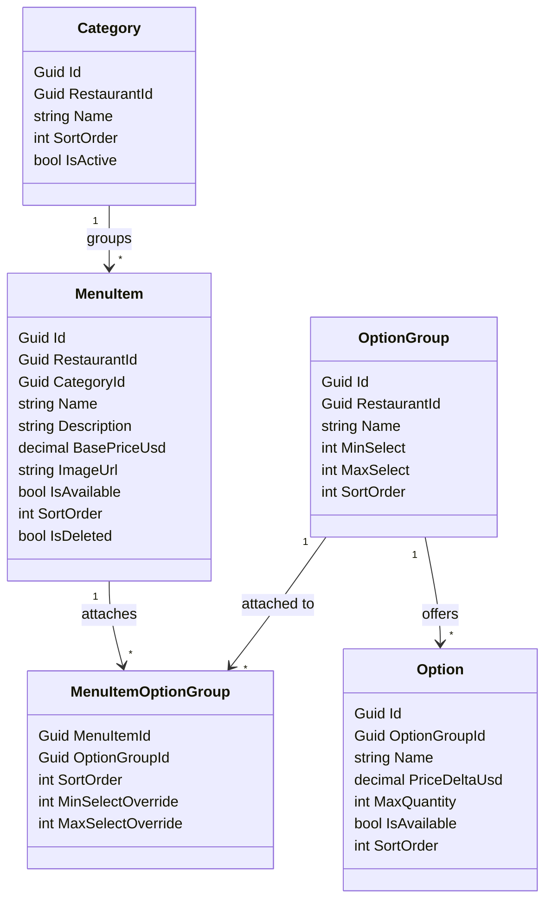
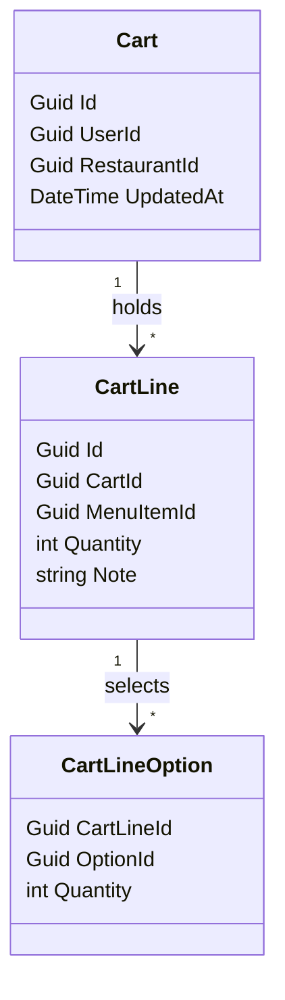
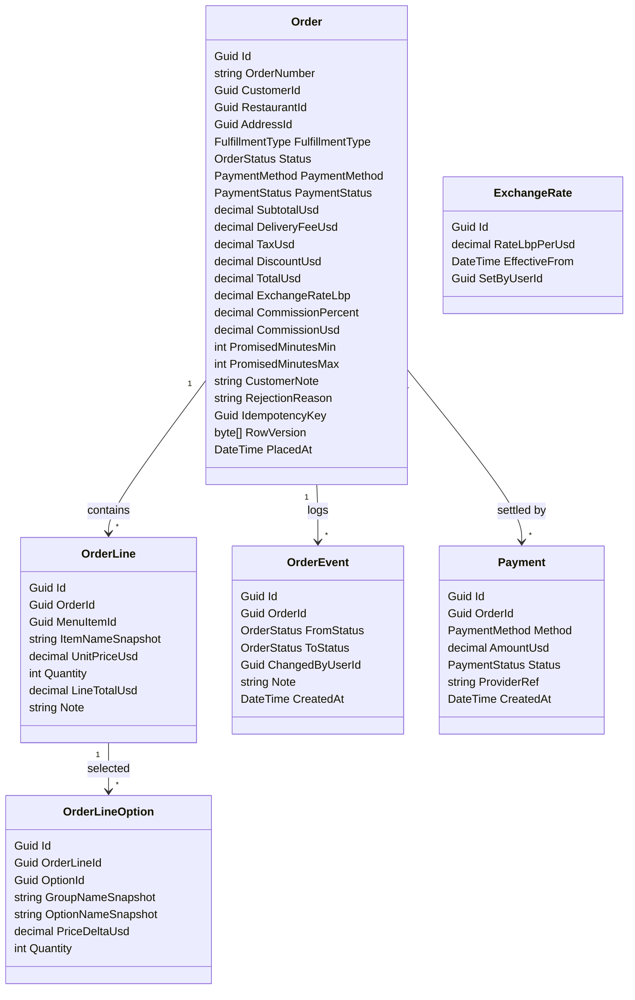
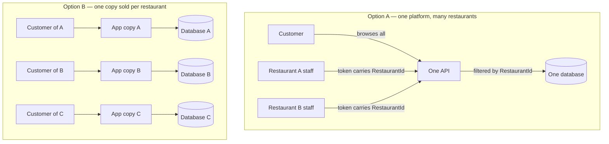

# Domain Model

**Status:** Proposal for review — no code written yet
**Companion to:** `ARCHITECTURE.md`
**Covers:** 24 entities across five clusters

Nullable columns are listed under each diagram rather than marked inside it, so the
diagrams stay readable. Exact types, indexes and constraints land in Step 4.

---

## 1. Identity, tenancy and auth

**Nullable:** `RefreshToken.UsedAt`, `RefreshToken.RevokedAt`, `PasswordResetToken.UsedAt`,
`Restaurant.Description`, `Restaurant.LogoUrl`.

**Notes.**
`RefreshToken.FamilyId` groups every token descended from one login. Reuse of a token that
already has `UsedAt` set revokes the whole family — that is the theft detection in ADR-10.
`PlatformSetting` is a key/value table holding the default commission and the stale-order
threshold; it is the home those values currently lack.

---

## 2. Geography and addresses

**Nullable:** `Address.Building`, `Address.Floor`, `Address.Landmark`, `Address.Lat`, `Address.Lng`.

**Notes.**
`DeliveryZone` is platform-level and shared. `RestaurantZone` is where fee and coverage live,
so two restaurants can charge different fees into the same zone. Lebanon has no reliable street
addressing, so `Landmark` carries real weight and coordinates are optional.

---

## 3. Menu and options

**Nullable:** `MenuItem.Description`, `MenuItem.ImageUrl`, `OptionGroup.MaxSelect` (null = unlimited),
`MenuItemOptionGroup.MinSelectOverride`, `MenuItemOptionGroup.MaxSelectOverride`.

**Notes.**
`MenuItemOptionGroup` is the many-to-many that lets one "Extras" group serve every burger.
The two override columns answer the per-item limit problem: null inherits the group's value,
a number applies to that item alone. Effective limit is `override ?? group`.

`MenuItem.IsDeleted` is a soft delete — a hard delete would orphan historical order lines.

---

## 4. Cart

**Nullable:** `CartLine.Note`.

**Notes.**
One cart per user per restaurant. The cart references *live* menu rows and carries no prices —
prices are read fresh on every view and only frozen at checkout. This is deliberate: a cart that
stored prices would let a customer hold a stale price indefinitely.

---

## 5. Orders, payment and money

**Nullable:** `Order.AddressId` (null for pickup), `Order.CustomerNote`, `Order.RejectionReason`,
`OrderLine.MenuItemId`, `OrderLine.Note`, `OrderLineOption.OptionId`, `OrderEvent.Note`,
`Payment.ProviderRef`.

**Notes.**

*The snapshot rule.* `OrderLine` and `OrderLineOption` keep the name and price as sold, and their
FKs to `MenuItem` and `Option` are nullable and used only for reporting. When a restaurant renames
a burger or raises its price, last month's orders stay exactly as they were sold.

*`CommissionPercent` is snapshotted too*, so changing a restaurant's rate never rewrites historical
settlement figures.

*`TaxUsd` stays at 0.* No tax was decided this round; the column remains so that turning VAT on
later is a config change rather than a migration plus a backfill of every historical total.

*`IdempotencyKey` carries a unique index.* A double-tap on a bad connection returns the original
order instead of creating a second one.

*`RowVersion` is the concurrency token.* Two staff pressing Accept on two tablets: the second write
fails and the UI refreshes, instead of both succeeding.

---

## 6. Why one multi-tenant platform, not a copy sold per restaurant

This is the fork worth being deliberate about, because the two paths are different businesses,
not just different code.

You are right that Option B gets isolation for free — restaurant A physically cannot reach
restaurant B's database, so no query filter can be forgotten. That is a genuine advantage and the
strongest argument for it.

Three things outweigh it.

**1. Multi-tenant is a superset. Single-tenant is a dead end.**
A multi-tenant system can be sold as a single-restaurant product by onboarding exactly one tenant —
same code, one row in `Restaurant`. Going the other way is a rewrite: adding `RestaurantId` to every
table, backfilling it, and reworking every query. Option A keeps both business models available;
Option B closes one permanently.

**2. Option B deletes about a third of the spec.**
Commission and two-directional settlement (spec §8) only exist when a platform sits between customer
and restaurant. So does the `PlatformAdmin` role, the shared `DeliveryZone` table, and cross-restaurant
browsing. If a customer of restaurant A is a different account from a customer of restaurant B, the
whole marketplace premise goes with it — including the part of the spec that is most worth showing.

**3. Operational cost scales linearly and eats the margin.**
Ten clients on Option B means ten databases to migrate on every release, ten deployments to keep in
step, and ten versions that drift the moment one client delays an upgrade. On Option A a release is
one migration and one deploy regardless of how many restaurants are on it.

**What Option A costs, stated honestly.** Isolation becomes a code property rather than a physical
one, and a bug in it is a cross-tenant data leak — the worst failure this system can have. That is
exactly why ADR-07 spends three layers on it (query filters, explicit write guards, and tests that
assert 403) instead of trusting any one of them.

**The escape hatch stays open.** If a client ever demands their own database — for a contract, or
because they are large enough to want it — you run a second instance of the same code with one
tenant in it. Nothing needs rewriting. That option only exists on Option A.
